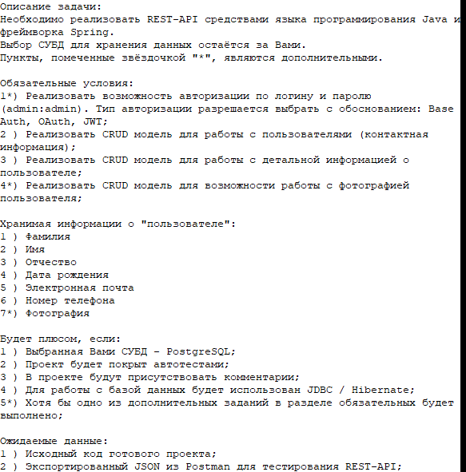

Тестовое задание:

### Проект "testTask3".

### Для запуска проекта :

1. Создать БД командой `create database userService;` ;

2. В файле "application.properties" вам необходимо внести ваши данные:
      (как минимум : пароль для БД)
- spring.datasource.url=jdbc:postgresql://127.0.0.1:5432/userService
- spring.datasource.username=postgres
- spring.datasource.password='passwordForUserService'(пароль для БД)

3. В файле "liquibase.properties" вам также необходимо внести ваши данные:
   (как минимум : пароль для БД)
- changeLogFile=src/main/resources/liquibase-changeLog.xm
- url=jdbc:postgresql://127.0.0.1:5432/itemService
- username=postgres
- password='passwordForItemService'(пароль для БД) ;

4. Запустить приложение командой `mvn spring-boot:run;` ;

5. Чтобы выполнить какие - либо действия, необходимо использовать
следующие данные для авторизации:

/auth/sign-in/

POST

{
"userName" : "User_Test",
"password" : "12345678900"
}

{
"userName" : "Administrator_Test",
"password" : "12345678902"
} ;

================================================================================================

================================================================================================
Endpoints:
==============

Auth:
==============

================================================================================================
Использованные данные, в качестве примера : {id}=1;{phone}=+79111111111;{email}=email@mail.ru;
{name}=User_Test;{password} : 12345678900;{name}=Administrator_Test;{password} : 12345678902;
================================================================================================
1)_/*АВТОРИЗАЦИЯ*/                                                                        

http://localhost:8080/auth/sign-in/

POST

{
"userName" : "userName",
"password" : "password"
}
================================================================================================
2)_/*ДОБАВЛЕНИЕ ПОЛЬЗОВАТЕЛЯ*/                                                             

http://localhost:8080/auth/sign-up/

POST

{
"userLastName" : "userLastName",
"userName" : "userName",
"userMiddleName" : "userMiddleName",
"userBirthDate" : "1970-01-01",
"password" : "password"
}
================================================================================================
3)_/*ВЫХОД(LOGOUT)*/                                                                       

http://localhost:8080/auth/auth_logout/

POST
================================================================================================

personContacts:
==============

4)_/*НАЙТИ СПИСОК ВСЕХ personContacts*/                                                    

http://localhost:8080/personContacts/

GET
================================================================================================
5)_/*НАЙТИ ПО ID personContacts*/                                                          

http://localhost:8080/personContacts/{id}

GET
================================================================================================
6)_/*Создать personContacts*/                                                              

http://localhost:8080/personContacts/

POST

{
"email" : "user@mail.ru",
"phone" : "+79111111111"
}
================================================================================================
7)_/*Обновить personContacts*/                                                             

http://localhost:8080/personContacts/

PUT

{
"email" : "user@mail.ru_Upd",
"phone" : "+79111111111_Upd"
}
================================================================================================
8)_/*Удалить personContacts*/                                                              

http://localhost:8080/personContacts/{id}

DELETE
================================================================================================
9)_/*Найти personContacts по email*/                                                       

http://localhost:8080/personContacts/findUserContactsByUserEmail?email=user@mail.ru

GET
================================================================================================
10)_/*Найти personContacts по phone*/                                                      

http://localhost:8080/personContacts/findUserContactsByUserPhone?phone=89111111111

GET
================================================================================================

personPhoto:
==============

11)_/*НАЙТИ СПИСОК ВСЕХ personPhoto*/                                                      

http://localhost:8080/personPhoto/

GET
================================================================================================
12)_/*НАЙТИ ПО ID personPhoto*/                                                            

http://localhost:8080/personPhoto/{id}

GET
================================================================================================
13)_/*Создать personPhoto*/                                                                

http://localhost:8080/personPhoto/

POST

{
"photo" : "AQID"
}
================================================================================================
14)_/*Обновить personPhoto*/                                                               

http://localhost:8080/personPhoto/

PUT

{
"photo" : "AQAD"
}
================================================================================================
15)_/*Удалить personPhoto*/                                                                

http://localhost:8080/personPhoto/{id}

DELETE
================================================================================================
16)_/*Найти personPhoto по Photo*/                                                        

http://localhost:8080/personPhoto/findUserPhotoByPhoto?photo=AQID
(вставляем фото в виде строки, закодированной в формате "BASE - 64")
GET
================================================================================================

person:
==============

17)_/*НАЙТИ СПИСОК ВСЕХ person*/                                                          

http://localhost:8080/person/

GET
================================================================================================
18)_/*НАЙТИ ПО ID person*/                                                                

http://localhost:8080/person/{id}

GET
================================================================================================
19)_/*Создать person*/                                                                    

http://localhost:8080/person/

POST

{
"userLastName" : "userLastName_NEW",
"userName" : "userName_NEW",
"userMiddleName" : "userMiddleName_NEW",
"userBirthDate" : "1970-01-01",
"password" : "password_NEW",
"userContacts" : {
"email" : "user_NEW@mail.ru",
"phone" : "+79211122112"
},
"userPhoto" : {
"photo" : "AQAD"
}
}
================================================================================================
20)_/*Обновить person*/                                                                    

http://localhost:8080/person/

PUT

{
"userLastName" : "userLastName_NEW_UPDATED",
"userName" : "userName_NEW_UPDATED",
"userMiddleName" : "userMiddleName_NEW_UPDATED",
"userBirthDate" : "1970-01-01",
"password" : "password_NEW_UPDATED",
"userContacts" : {
"email" : "user_NEW_UPDATED@mail.ru",
"phone" : "+79211122119"
},
"userPhoto" : {
"photo" : "AQAD"
}
}
================================================================================================
21)_/*Удалить person*/                                                                    

http://localhost:8080/person/{id}

DELETE
================================================================================================
22)_/*Получить текущего  person*/                                                         

http://localhost:8080/person/getCurrentUser

GET
================================================================================================
================================================================================================
23)_/*Найти person по имени*/                                                             

http://localhost:8080/person/findByUserName?userName=userName

GET
================================================================================================
================================================================================================

================================================================================================

Стек технологий : Java 17; PostgreSQL 14;spring-boot 2.7.14;.
Требования к окружению : Java 17, Maven 3.8, PostgreSQL 14 - 16.

Контакты : mariosb84@mail.ru .

=================================================================================================
